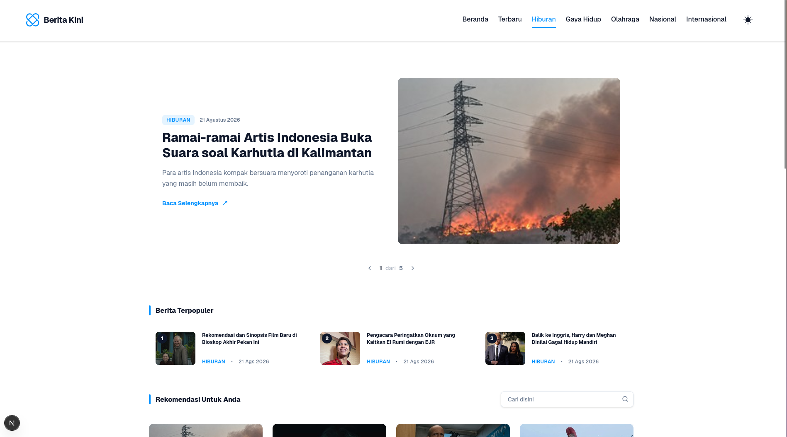

<p align="center">
  
</p>

<h1 align="center">Glimpsy</h1>

<p align="center">
  A modern news aggregator portal built with Next.js 16 & Tailwind CSS v4.
</p>

<p align="center">
  
</p>

---

## About

Glimpsy is a news aggregator web application built for the SEAL Technical Test. This project consumes a news API and strictly implements the *Berita Kini* UI design provided in the assessment brief.

It fetches live news articles from CNN Indonesia across multiple categories, presenting them in a clean, responsive, dark-mode-ready interface.

## Tech Stack

| Layer | Technology |
|---|---|
| Framework | Next.js 16.3 (App Router) |
| Language | TypeScript |
| Styling | Tailwind CSS v4 |
| Animations | Framer Motion / Motion |
| UI Primitives | Base UI, Shadcn |
| Icons | Lucide React |
| Theming | next-themes |
| Font | Geist (next/font/google) |

## Features

- 🗞️ **Live News Feed** — fetches from CNN Indonesia REST API across 7 categories (Terbaru, Nasional, Internasional, Ekonomi, Olahraga, Hiburan, Gaya Hidup)
- 🎠 **Hero** — animated featured article carousel on the homepage
- 🔍 **Search & Filter** — real-time search with category filtering and smart pagination
- 📰 **Article Detail** — full article page with related news, comment section, and source citation footnote
- 💬 **Comments** — client-side comment & reply system
- 🌙 **Dark Mode** — animated theme toggle with `next-themes`; navbar adapts color on scroll
- 📱 **Responsive** — mobile-first layout with collapsible hamburger navigation

## Project Structure

```
glimpsy/
├── app/                        # Next.js App Router
│   ├── article/[slug]/         # Dynamic article detail page
│   ├── globals.css             # Design tokens & CSS variables
│   └── layout.tsx              # Root layout (font, theme provider)
│
├── features/                   # Feature-based modules
│   ├── article/                # Article detail components & services
│   │   └── components/         # ArticleContent, Hero, Breadcrumb
│   ├── comments/               # Comments feature (types, service, UI)
│   ├── news/                   # News listing (hooks, API, components)
│   │   └── components/         # NewsCard, PopularList, RecommendationGrid
│   ├── related-news/           # RelatedNews widget + skeleton
│   └── layout/                 # Navbar & Footer
│
└── shared/                     # Cross-feature utilities
    ├── lib/utils.ts             # slugify, formatDate, cn()
    └── components/             # Avatar, ThemeToggle, ThemeProvider
```

## Getting Started

```bash
# Install dependencies
npm install

# Run development server
npm run dev
```

Open [http://localhost:3000](http://localhost:3000) in your browser.

## Environment

No environment variables are required. The app fetches news from a public REST API endpoint directly.

---

<p align="center">Built with ❤️ · SEAL Technical Test</p>
